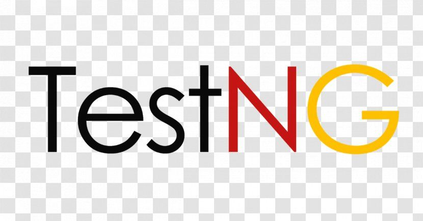
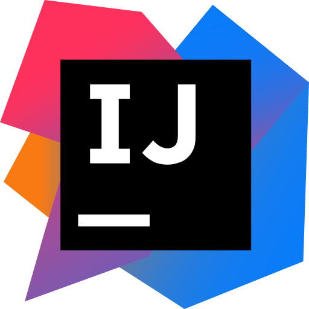

<h1 align="center">Hey there,👋 I'm Anna!</h1>

<!-- Social icons section-->

  

    
  

## About me

I'm a QA engineer who loves learning new things and diving into the details 🔎  
🎓 Completed non-Commercial IT School RedRover QA Automation with Java (online course) (2023)   
🛠️ Java Automation QA Intern at <a href="https://www.simbirsoft.com/">SimbirSoft</a> (2024)   
🚀 QA Trainee at tech startup project (2025)  
💻 Automating tests in Java, specializing in UI and API testing  
⚡ Making sure everything runs smoothly, so I don’t have to break out my emergency “Fix-It” coffee 😉

## Tech Stack

<h2>Tools</h2>

>
>

## Projects

  <ul>
    <li><a href="https://github.com/AnnaAbg/Online_Pharmacy_Project">Tiny demo project with auto tests</li>
    <li><a href="https://github.com/AnnaAbg/99BottlesProjectJava">Auto tests for 99 Bottles of Beer site</li>
    <li> Contributing to the RedRover School projects </li>
  </ul>

## Hobbies

  <ul>
    <li>learning new languages 📚</li>
    <li>reading 📖</li>
    <li>chess ♕</li>
    <li>astronomy 🌠</li>
    <li>music 🎵, piano 🎹</li>
  </ul>

